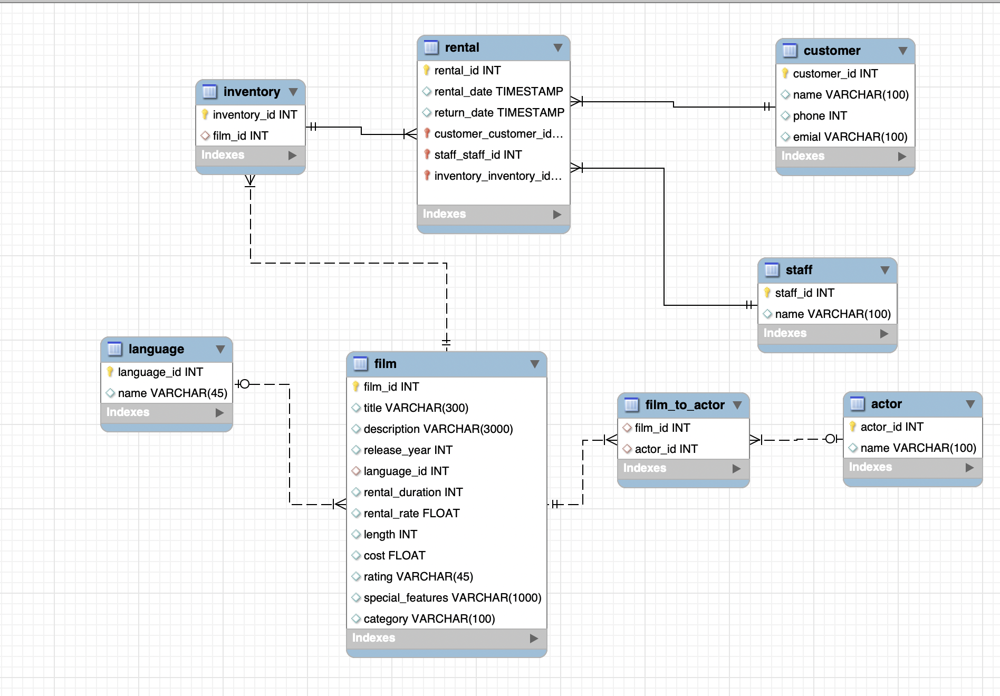

# Videclub DataBase Project 🎬

## Cración de la estructura de la base de datos en SQL e importación de datos

 Para realizar este proyecto, parte del bootcamp de Data Analytics de Ironahck, se otorgaron 7 archivos csv (original_data) pertenecientes a un videoclub, en los que se mostraba el inventario, un registro de películas, los datos de un disco duro, etc. 
 
 Lo primero que hubo que hacer fue importar los archivos a un dataframe de pandas para su limpieza. Para realizar dicha limpieza, se asumió que el inventario estaba correcto y que la empresa, con dos videoclubs, tenía el objetivo de cerrar ambos para abrir uno unificando así el negocio. La siguiente parte del proyecto consistía en crear la estructura de una base de datos en SQL, siguiendo este razonamiento. La limpieza y el diseño de la estructura se realizaron simultaneamente, debido a la necesidad de prepar los datos para su posterior exportación a la base de datos. La estructura quedo diseñada de la siguiente manera:

 

## Querys

Una vez importados los datos a la base de datos SQL, se lanzaron 10 querys para obtener información acerca de los mismos. Cabe añadir que, debido a que se asume que el nuevo videoclub no se encuentra abierto todavía, las tablas rental, customer y staff se encuentran vacias. Entre las querys que se realizaron están las películas más repetidas en el inventario, el coste de conseguir todas las películas de la lista de las mismas que no se encuentran en el inventario y que categorías predominan mas entre las películas de la lista.